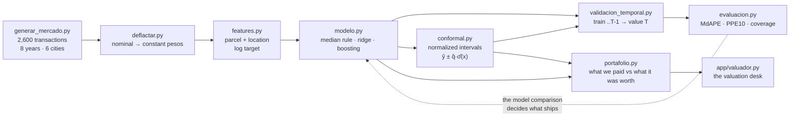
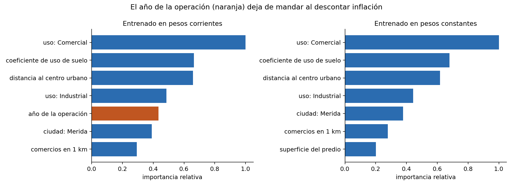
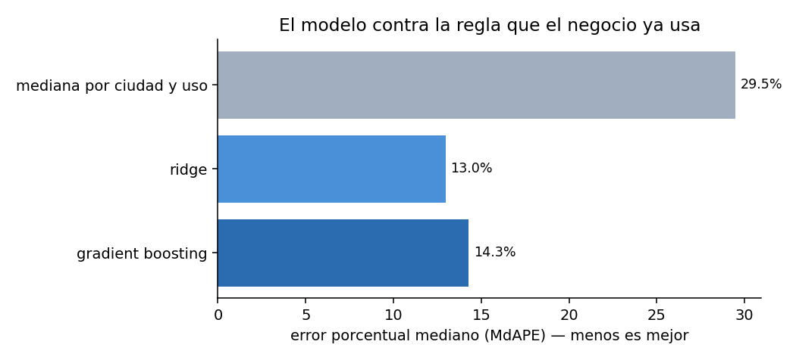
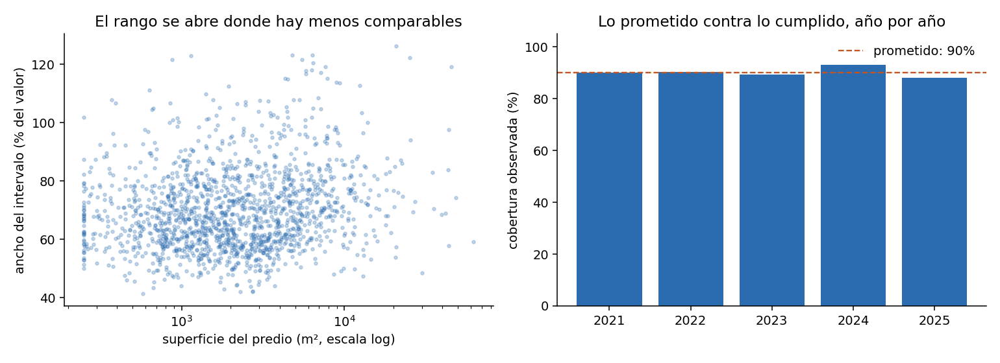

# Land Valuation Model — What a Parcel Is Worth, and How Sure

> An automated valuation model for a real estate portfolio: estimates price per
> square metre from location and parcel characteristics, returns a **calibrated
> range rather than a single number**, and turns the residuals into a shortlist
> of parcels the group bought outside the market.

    

> [!IMPORTANT]
> **Reference implementation on synthetic data.** Every transaction, price and
> parcel is produced by `src/generar_mercado.py` from a fixed seed. No real
> record — anonymized or otherwise — is used anywhere in this repository. The
> modeling decisions, the validation protocol and the business framing are the
> ones I would deploy; the numbers describe this synthetic market and nothing
> else.

**▶ Live demo: <https://property-valuation-model.streamlit.app>** — *first load may take ~40s while the free instance wakes up.*

---

## The problem

A real estate group buys land. Every purchase needs an answer to "is this a
fair price?", and the answer today comes from a table of median prices by city
and land use, plus somebody's judgment. That table has two problems: it cannot
tell you how confident it is, and it treats a corner lot on a main avenue the
same as a landlocked parcel two blocks away.

There is a second question nobody can answer with a spreadsheet: **of what we
already own, what did we overpay for?** Comparing a 2018 purchase to a 2024 one
requires holding inflation constant, valuing each against the market of its own
year, and knowing when a difference is large enough to matter.

## What I built

A valuation model trained on 2,600 synthetic land transactions across six
Mexican cities and eight years, validated year by year, wrapped in conformal
prediction intervals with measured coverage, and pointed at the group's own
portfolio.

| | |
|---|---|
| **Stack** | Python 3.11+ · scikit-learn · conformal prediction · Streamlit |
| **Data** | 2,600 transactions · 6 cities · 5 land uses · 2018–2025 · 64 owned parcels |
| **Validated on** | 5 years, expanding window, 1,609 out-of-sample valuations |
| **Accuracy** | **13.0% median error**, 72% of valuations within ±20% — against 29.5% for the rule the business uses today |
| **Intervals** | 90% promised, **90.2% observed**, median width ±34% |
| **Runs with** | no credentials, no database, no network |

---

## Architecture



---

## Design decisions

### Deflate before modeling, or you are predicting inflation

Prices in a deed are nominal. Train on them directly and the strongest pattern
in the data is that recent is expensive — which is not value, it is money losing
purchasing power. Over the eight years in this dataset **the price index rose
40.3%**, while median prices in constant pesos barely moved. Almost the entire
nominal increase is inflation, and it is sitting there waiting to be learned and
presented as market knowledge.

This is not an argument, it is a measurement. The same model, trained twice:



| | Rank of *year of transaction* | Relative weight |
|---|---|---|
| Trained on nominal prices | **5th** of 20 | 0.43 |
| Trained on constant pesos | 12th of 20 | 0.05 |

**Nine times less weight.** The first model looked fine on every metric — it just
wasn't valuing land. And it would have kept not valuing land, quietly, because
nothing about its error would have revealed it.

*(One methodological note, because it matters: this specific diagnostic uses a
random split, not the temporal one used everywhere else. Permutation importance
shuffles a column and measures the damage; if the evaluation set is a single
year, "year" is constant, shuffling it does nothing, and it scores zero
importance no matter how much the model leans on it. The temporal split still
governs every accuracy number in this repo — see `explicacion.py`.)*

### Model price per square metre, in logs

Price *per m²* rather than total price: total price is dominated by area, so a
model predicting it captures 95% of the variance by learning to multiply, and
learns nothing about valuation.

In logs because the market is multiplicative. A corner does not add $800/m², it
adds a percentage. The second kilometre from the city centre does not cost what
the tenth costs. And since parcels here range from $450 to $35,000 per m², the
error worth minimizing is relative, not absolute — which is exactly what a log
target does.

### The linear model won, so the linear model ships



| Model | Median error | Within ±10% | Within ±20% |
|---|---|---|---|
| Median by city and use *(today's rule)* | 29.5% | 18% | 34% |
| **Ridge regression** | **13.0%** | **39%** | **72%** |
| Gradient boosting | 14.3% | 35% | 66% |

The gradient boosting lost. With 2,600 comparables and a market whose structure
is mostly multiplicative, a regularized linear model in log space has enough
capacity to describe it and less room to overfit. Boosting needs more data per
segment than a land market produces.

I kept it in the repo and in the comparison rather than deleting it, because
running the comparison is the point. **Shipping the boosting model here would
have cost accuracy and bought nothing but a more impressive-sounding stack.**

### A valuation is a range, and the range has to be earned

Telling an investment committee a parcel "is worth $8,400/m²" is not useful. The
next question is *how sure*, and ±8% versus ±40% changes the decision.

The intervals here are **normalized conformal prediction**: a second model
learns where the first one tends to be wrong — `σ̂(x)` — and a calibration step
on held-out data scales it until the promised coverage actually holds.

```
interval(x) = ŷ(x) ± q̂ · σ̂(x)
```

The adaptive part is not decoration. A 60,000 m² industrial parcel 20 km out has
far fewer comparables than a central retail lot, and the interval says so:



| | |
|---|---|
| Promised coverage | 90% |
| **Observed coverage** | **90.2%** |
| Median width | ±34% of value |
| Worst decile | ±44% of value |

**On the theory, honestly:** conformal prediction guarantees finite-sample
coverage *under exchangeability*, and the 2025 market is not a permutation of
the 2019 one. So this repo does not cite the theorem and move on — it measures
empirical coverage year by year on the temporal split, which is the only
evidence that means anything here. It holds between 88% and 93% every year.

*I tried CQR (conformalized quantile regression) first. It lost: extreme
quantiles need more observations than a land market gives you per city per year,
they came out badly estimated, and the conformal correction had to widen the
interval to ±55% to compensate. Normalizing the scale asks far less of the data.*

### Never a random split — and a test that proves the calibration is clean

Training on 2025 and testing on 2019 lets the model see where the market went
before being asked to predict it. Everything here trains on years `..T-1` and
values year `T`.

There is a subtler version of the same mistake, and it is invisible: calibrating
the conformal interval on the data the model was fitted on. `tests/test_pipeline.py`
measures it rather than warning about it:

| Point model | Calibrated correctly | Calibrated on its own training data |
|---|---|---|
| Ridge | 88.2% coverage | 88.2% coverage — no real effect |
| Gradient boosting | 86.5% coverage | **63.2% coverage**, interval 42% narrower |

The flexible model is the one that pays. It promises 90%, delivers 63%, produces
tighter and more confident-looking intervals, and nothing anywhere throws an
error.

---

## What the model says about the portfolio

Each of the group's 64 parcels is valued against **the market of the year it was
bought** — judging a 2019 decision with 2025 information would be unfair and
useless — and compared to what was actually paid, in constant pesos.

```
invested (constant pesos)    $1,825 M
value today                  $1,848 M
real appreciation                +1.2%
```

That +1.2% is the headline, and it is misleading in an interesting way:

> **Excluding the nine parcels the model flags for review, real appreciation is
> +8.1% instead of +1.2%.** A handful of purchases account for almost the entire
> gap.

Against the hidden label (12 parcels were generated deliberately off-market), at
a 90% interval the model flags 9 parcels and 6 of them are real — 67% precision,
50% recall. Loosening the screen to 80% catches all 12 at 48% precision:

| Interval | Flagged | Correct | False | Recall | Precision |
|---|---|---|---|---|---|
| 90% | 9 | 6 | 3 | 50% | 67% |
| 80% | 25 | 12 | 13 | 100% | 48% |
| 70% | 28 | 12 | 16 | 100% | 43% |

**The threshold is a policy decision, not a model property.** Reviewing too much
costs analyst hours; missing an overpriced purchase costs the purchase. The app
exposes the slider so the trade-off is made with numbers instead of habit.

One thing worth noticing in the output: a parcel can sit 47% above the model's
point estimate and still read *within market*, because it is the kind of parcel
the model values with low confidence. **The gap alone does not decide — leaving
the range does.** That distinction is the whole reason for building intervals.

---

## Where it fails

| Land use | Median error | | City | Median error |
|---|---|---|---|---|
| Residential | 13.1% | | Aguascalientes | 13.1% |
| Industrial | 13.3% | | Puebla | 13.3% |
| Mixed | 13.5% | | León | 14.3% |
| Retail | 15.4% | | Querétaro | 14.4% |
| Office | 16.0% | | Culiacán | 14.6% |
| | | | Mérida | 17.0% |

Office is the weakest segment and it is the smallest (201 transactions), which
is the ordinary explanation. Mérida is the weakest city despite decent volume —
it also has the fastest real appreciation in the dataset, so the market is
moving under the model faster than elsewhere. That is the kind of finding that
tells you where *not* to trust an automated valuation, which is as useful as
knowing where to.

---

## Run it

No credentials, no database, no network.

```bash
git clone https://github.com/chino-bot1701/property-valuation-model.git
cd property-valuation-model
pip install -r requirements.txt

python scripts/run_demo.py          # the whole pipeline, ~1 min, ends in assertions
streamlit run app/valuador.py

pip install -r requirements-dev.txt && pytest -q      # 32 tests
```

`run_demo.py` prints every stage, writes the four charts above into `docs/`,
writes the fixtures the app reads, and finishes with eleven assertions. If the
pipeline degrades it exits non-zero instead of printing nice numbers.

### In the app

- **Valuar un predio** — set the parcel's characteristics and get the estimate,
  the interval at your chosen confidence, and the eight closest comparables.
- **La cartera** — the 64 owned parcels, what was paid against what the model
  says, with the strictness slider.
- **Por qué creerle** — the model comparison, coverage by year, and the
  deflation experiment.

---

## Repository layout

```
src/generar_mercado.py        synthetic land market: scale, location, heteroscedastic noise
src/deflactar.py              nominal → constant pesos. the step everything depends on
src/features.py               parcel and location features, log target
src/modelo.py                 median rule · ridge · gradient boosting
src/conformal.py              normalized conformal intervals with measured coverage
src/validacion_temporal.py    expanding window, never a random split
src/evaluacion.py             MdAPE, PPE10/20, coverage, breakdown by segment
src/explicacion.py            permutation importance and the deflation experiment
src/portafolio.py             what we paid vs what it was worth, and the screen
scripts/run_demo.py           end-to-end pipeline, charts, assertions
app/valuador.py               the Streamlit valuation desk
tests/                        32 tests: leakage, calibration, coverage, shape
docs/*.png                    charts produced by run_demo.py
```

---

## What I would do next

- **Real geography.** Distance to centre is a crude proxy. With coordinates, the
  right move is a spatial term — nearby parcels share unobserved value that no
  tabular feature captures.
- **Quantify how stale the model gets.** Coverage holds year to year here; the
  operational question is how many months it holds before retraining, and that
  is measurable with the same expanding window.
- **Segment-specific models where volume allows.** Office is the weakest segment
  and the smallest; the honest options are more data or a wider interval, and
  the repo should say which.
- **Connect it to the portfolio dashboard.** The parcels valued here are the same
  ones mapped in [property-portfolio-geo](https://github.com/chino-bot1701/property-portfolio-geo);
  the valuation belongs on the map.

---

## About the data

Everything comes from `src/generar_mercado.py` with a fixed seed. Cities,
companies and land uses belong to the same fictional group used across this
portfolio and resemble no real organization. The price index has the shape of
Mexico's INPC for the period but is synthetic; a real deployment reads the
published INEGI series.

The generator encodes real structure — unit price falling with parcel size,
non-linear decay with distance, buildable ratio driving commercial land,
heteroscedastic noise that widens for unusual parcels — because a model that has
nothing to discover proves nothing. What it does not encode is any real
transaction.
